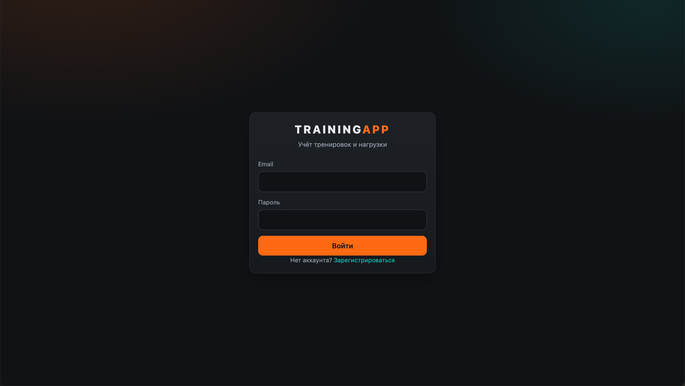
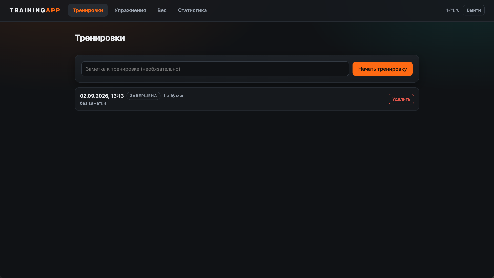
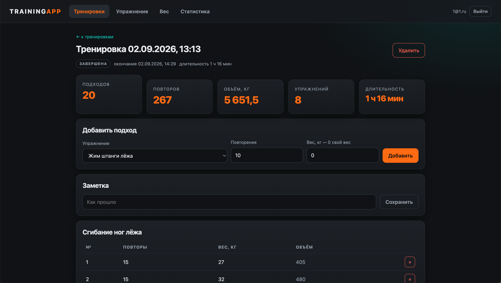
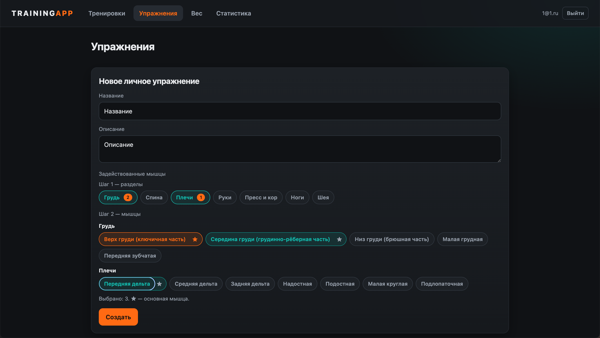
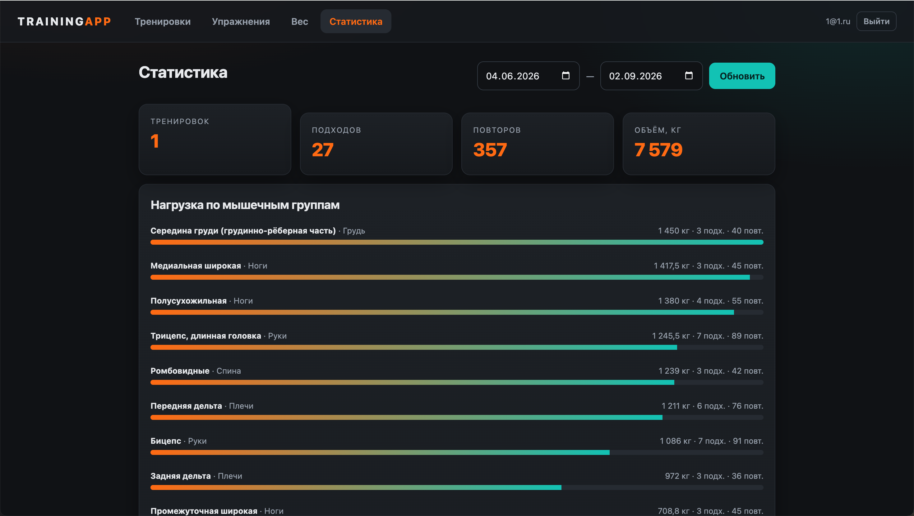
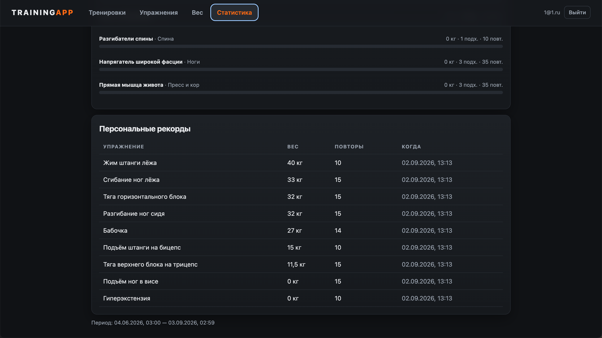
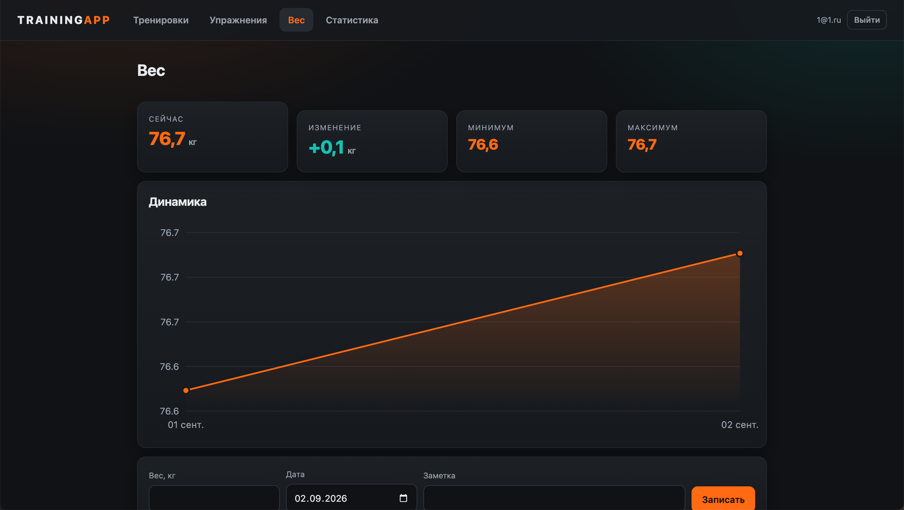
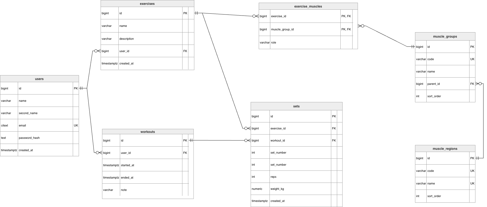

# trainingApp

Сервис учёта силовых тренировок: журнал подходов, каталог упражнений с разметкой по мышечным группам, статистика нагрузки и динамика массы тела.

Развёрнутая версия: **https://trainlog-ru.duckdns.org**

Учебный проект на Go. Задача — разобраться с PostgreSQL, HTTP на стандартной библиотеке и конкурентностью.



## Функциональные возможности

Тренировка регистрируется отдельным запросом; завершение оформляется вызовом `POST /api/v1/workouts/finish/{id}`, который проставляет `ended_at`. Длительность вычисляется на клиенте как разность `started_at` и `ended_at`; для незавершённой тренировки верхней границей служит текущий момент.



Подходы фиксируются в рамках тренировки и группируются по упражнениям. Порядковый номер подхода определяется автоматически как инкремент максимального номера в пределах упражнения. Нулевое значение веса соответствует работе с собственной массой тела.



Каталог включает 47 системных упражнений; пользователю доступно создание собственных. Справочник мышечных групп клиент запрашивает у сервера через `GET /api/v1/muscle-groups`. Назначение мышечных групп выполняется в два этапа: выбор анатомических разделов (7 регионов), затем выбор групп в пределах отмеченных разделов (49 групп). Ровно одной группе присваивается роль `primary`, остальным — `secondary`.



Статистика включает сводные показатели за период, распределение объёма по мышечным группам и персональные рекорды. Вклад группы в роли `secondary` учитывается с коэффициентом 0,5. Три независимые выборки выполняются параллельно средствами `errgroup`.





Для массы тела принята дискретизация по суткам: на календарную дату приходится не более одного измерения. Повторная запись за ту же дату обновляет существующую запись конструкцией `ON CONFLICT ... DO UPDATE`. График реализован средствами inline SVG без привлечения сторонних библиотек.



## Технологии реализации

Серверная часть построена на Go 1.25. Маршрутизация опирается на `net/http` с поддержкой шаблонов путей, введённой в версии 1.22. Доступ к данным реализован через `database/sql` с расширением `sqlx` и драйвером `pgx/v5`; используется PostgreSQL 17. Запросы формулируются вручную, отображение результатов на структуры выполняется явно. Схема базы поддерживается миграциями `goose`, оформленными отдельным исполняемым файлом. Аутентификация построена на JWT (`golang-jwt/v5`) с хешированием паролей алгоритмом bcrypt; идентификатор пользователя передаётся между слоями через `context`. Журналирование обеспечивает `slog`, чтение конфигурации — `cleanenv`.

Клиентская часть написана на React 18 и TypeScript 5.6, сборка выполняется Vite 5, маршрутизация — `react-router` 6. Библиотеки готовых компонентов не используются, стили определены вручную. Токен сохраняется в `localStorage`; получение ответа 401 инициирует сброс сессии, срок действия контролируется по полю `expires_at`.

Образы собираются в несколько стадий. Рантайм-образ API занимает 12,9 МБ и исполняется от непривилегированного пользователя. Раздачу статических файлов обеспечивает nginx, терминирование TLS — Caddy с автоматическим выпуском сертификатов Let's Encrypt.

## Модель данных

```
users 1──M workouts 1──M sets M──1 exercises 1──M exercise_muscles M──1 muscle_groups M──1 muscle_regions
users 1──M body_weights
```



Атрибут `exercises.user_id` допускает NULL: такие упражнения относятся к системным и доступны всем пользователям. Строка таблицы `sets` соответствует одному подходу; агрегированные показатели не хранятся, а вычисляются на этапе выборки. Для связей с `workouts` и `users` установлено каскадное удаление, для связей с `exercises` и `muscle_groups` — ограничивающее.

## Программный интерфейс

Интерфейс включает 27 эндпоинтов; полная спецификация приведена в [`api.yml`](api.yml) в формате OpenAPI 3.0.3.

| Группа | Эндпоинты |
|---|---|
| Аутентификация | `POST /api/v1/auth/register`, `POST /api/v1/auth/login` |
| Упражнения | CRUD по `/api/v1/exercises`, `GET`/`PUT` `/api/v1/exercises/{id}/muscles` |
| Мышечные группы | `GET /api/v1/muscle-groups`, `GET /api/v1/muscle-groups/{code}/exercises` |
| Тренировки | CRUD по `/api/v1/workouts`, `POST /api/v1/workouts/finish/{id}` |
| Подходы | CRUD по `/api/v1/sets`, `GET /api/v1/sets/byWorkout/{id}` |
| Статистика | `GET /api/v1/stats?from&to` |
| Масса тела | `GET`/`POST` `/api/v1/weights`, `DELETE /api/v1/weights/{id}` |

Все маршруты пространства `/api/v1/`, за исключением регистрации и аутентификации, требуют заголовка `Authorization: Bearer <token>`. Проверка работоспособности `/health` выполняется без авторизации.

## Локальное развёртывание

Конфигурация задаётся файлом `.env`, создаваемым из `.env.example`. Обязательному заполнению подлежат `POSTGRES_PASSWORD` и `JWT_SECRET`; при длине секрета менее 32 байт приложение прерывает запуск с ошибкой валидации.

```bash
cp .env.example .env
docker compose up -d --build
```

Разворачиваются четыре сервиса: PostgreSQL, одноразовый контейнер миграций, API и клиентское приложение. Последовательность запуска задаётся условиями `depends_on`: API ожидает готовности базы данных и успешного завершения миграций, клиентское приложение — прохождения healthcheck со стороны API. Интерфейс доступен по адресу `http://localhost:3000`, база данных — с хоста на порту 5433.

При разработке клиентской части предпочтителен запуск Vite напрямую: сервер разработки проксирует `/api` и `/health` на порт 8080.

```bash
cd frontend && npm install && npm run dev
```

## Развёртывание в производственной среде

Производственный контур описан в `docker-compose.prod.yml` и применяется поверх основного файла. Отличия сводятся к следующему: наружу публикуются только порты 80 и 443 сервиса Caddy, публикация портов PostgreSQL и клиентского приложения отменяется директивой `ports: !reset []`, формат журналов переключается на JSON.

```bash
docker compose -f docker-compose.yml -f docker-compose.prod.yml up -d --build
```

До запуска доменное имя, заданное переменной `DOMAIN`, должно разрешаться в адрес сервера: Caddy проходит проверку HTTP-01 удостоверяющего центра Let's Encrypt, и при некорректной DNS-записи выпуск сертификата завершается отказом. Сертификаты сохраняются в томе `caddy_data` и сохраняются при пересоздании контейнеров.

Текущая конфигурация сервера — Ubuntu 24.04, 1 vCPU, 1 ГБ оперативной памяти. Сборка образов на такой конфигурации требует файла подкачки: без него `npm ci` и компиляция Go завершаются аварийно по исчерпании памяти.

## Конфигурация

| Переменная | Назначение |
|---|---|
| `DATABASE_URL` | DSN PostgreSQL; в compose переопределяется адресом внутренней сети |
| `JWT_SECRET` | ключ подписи токенов, не менее 32 байт |
| `JWT_TTL` | срок действия токена, по умолчанию `30m` |
| `POSTGRES_USER`, `POSTGRES_PASSWORD`, `POSTGRES_DB` | учётные данные базы данных |
| `PORT` | порт HTTP-сервера, по умолчанию `8080` |
| `LOG_LEVEL`, `LOG_FORMAT` | уровень детализации и формат журналов (`text` либо `json`) |
| `DOMAIN` | доменное имя для выпуска сертификата, только для производственного контура |

Обязательные переменные объявлены в compose в форме `${VAR:?}`: отсутствие значения приводит к прерыванию запуска, что исключает старт сервиса с пустым паролем. Файл `.env` исключён из системы контроля версий и из контекста сборки образа.

## Организация исходного кода

```
cmd/api             точка входа, graceful shutdown
internal/api        HTTP-хендлеры, роутер, middleware
internal/postgres   репозитории, SQL
internal/{exercise,workout,set,user,weight,stats}
                    доменные модели и валидация
internal/auth       выпуск и проверка JWT
internal/config     чтение конфигурации
migrations          9 миграций goose, включая наполнение справочников
frontend            клиентское приложение
deploy              Caddyfile
```

Интерфейсы хранилищ объявлены на стороне потребителя — в пакете `api`, рядом с хендлерами, а не в пакете `postgres`.

## Известные ограничения

Персональные рекорды упорядочиваются по весу без учёта числа повторений, вследствие чего подход 100 кг × 1 опережает подход 95 кг × 12. Корректная оценка требует ранжирования по расчётному одноповторному максимуму. Кроме того, выборка рекордов не ограничена периодом дашборда: изменение диапазона дат в интерфейсе на неё не влияет.

Упражнения с собственной массой тела дают нулевой вклад в объём, поскольку вес подхода равен нулю. Учёт массы тела потребует введения коэффициента на уровне упражнения и соединения с таблицей `body_weights` по дате тренировки.

Счётчики подходов и повторений в разрезе мышечных групп завышены: соединение с `exercise_muscles` дублирует строку подхода по числу связанных групп. Для объёма, взвешенного по ролям, такое поведение корректно, для счётчиков — нет.

